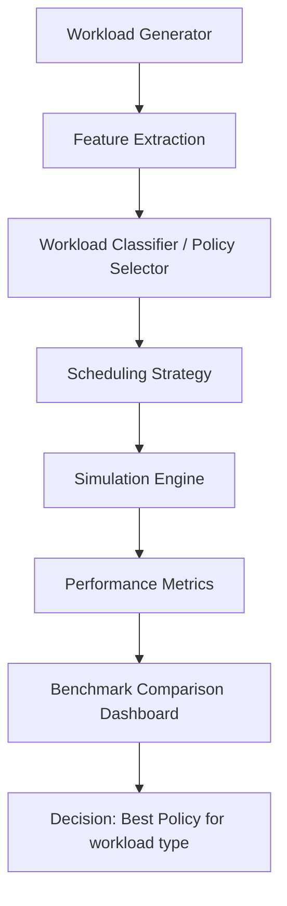

# Architecture Overview

## 1. Project purpose

This project aims to build the **Q-Shedular** adaptive CPU scheduler, which selects the best scheduling policy based on workload characteristics. The goal is to compare adaptive scheduling against standard algorithms such as FCFS, SJF, Priority, and Round Robin, and evaluate performance using measurable scheduling metrics.

The project is intentionally research-oriented: it is not just a runtime scheduler, but a simulation and benchmarking platform for studying scheduling behavior under different workload types.

---

## 2. Current state of the project

The repository is at a strong conceptual stage but still in a scaffolded/prototype phase.

### What exists now
- Core research goal is clearly defined in [README.md](README.md)
- A Python packaging setup exists in [pyproject.toml](pyproject.toml)
- A simple Streamlit entry app exists in [app.py](app.py)
- One working scheduler implementation exists in [scheduler/fcfs.py](scheduler/fcfs.py)
- A single basic test exists in [tests/test_scheduler.py](tests/test_scheduler.py)

### What is still missing
- Implementation for SJF, Priority, Round Robin, and Adaptive scheduling
- AI/classification logic in [ai/classifier.py](ai/classifier.py)
- Simulation engine for event-based or time-sliced CPU scheduling
- Benchmarking and metrics engine in [experiments/benchmark.py](experiments/benchmark.py) and [metrics/performance.py](metrics/performance.py)
- Workload generator and workload profiles in [workloads/generator.py](workloads/generator.py)
- Real adaptive policy selection logic

This means the project currently demonstrates a starting foundation rather than a complete research system.

---

## 3. Intended architecture

The architecture should follow a clear pipeline:



### Core components

#### 1. Workload layer
Responsible for generating synthetic workloads that represent different execution scenarios:
- CPU-bound workloads
- I/O-bound workloads
- interactive workloads
- bursty workloads
- mixed workloads
- priority-heavy workloads

This layer should create realistic process objects with properties like:
- pid
- arrival_time
- burst_time
- priority
- io_burst
- cpu_burst_history
- deadline
- remaining_time
- state

#### 2. Scheduling strategies layer
Each scheduling policy should be implemented behind a common interface.

Example responsibilities:
- FCFS
- SJF
- Priority
- Round Robin
- Adaptive policy selector

Each strategy should expose a consistent API such as:
- `schedule(processes)`
- `simulate(processes, quantum=None)`
- `compute_metrics(results)`

#### 3. AI / policy selection layer
This is the most important innovation in the project.

The adaptive logic should analyze features from the workload, such as:
- average burst length
- variance of burst lengths
- arrival distribution
- number of I/O requests
- priority spread
- inter-arrival density
- system load

The selector then decides which scheduler is most appropriate:
- short CPU bursts -> SJF
- consistent fairness and latency -> Round Robin
- strict priority requirement -> Priority
- bursty/heterogeneous workload -> Adaptive hybrid policy

This can be implemented in stages:
1. heuristic rules (simplest and most explainable)
2. rule-based classifier
3. ML model such as Random Forest or Logistic Regression

#### 4. Simulation and metrics engine
This layer executes the policy over a generated workload and computes results.

Key metrics include:
- average waiting time
- average turnaround time
- average response time
- throughput
- CPU utilization
- context switch count
- fairness index
- starvation risk

This engine should generate standardized comparison data for every algorithm over the same workload.

#### 5. Experiment and comparison layer
This layer runs repeated experiments, generates workloads, and compares algorithms under multiple scenarios.

A strong research setup should include:
- seeded random generation
- many workload samples per scenario
- aggregation of metric distributions
- result tables and charts
- statistical comparison of policies

#### 6. Interface layer
The project already includes Streamlit, which is a good fit for:
- workload configuration
- policy comparison dashboards
- charts and tables
- experiment controls

This layer should connect the back-end simulation engine to a user-friendly research interface.

---

## 4. Recommended component structure

A clean project structure should look like this:

```text
adaptive_cpu_scheduler/
├── app.py
├── README.md
├── architecture.md
├── pyproject.toml
├── src/
│   └── adaptive_cpu_scheduler/
│       ├── __init__.py
│       ├── core/
│       │   ├── process.py
│       │   ├── scheduler_interface.py
│       │   └── simulation.py
│       ├── algorithms/
│       │   ├── fcfs.py
│       │   ├── sjf.py
│       │   ├── priority.py
│       │   ├── round_robin.py
│       │   └── adaptive.py
│       ├── workloads/
│       │   ├── generator.py
│       │   └── profiles.py
│       ├── ai/
│       │   ├── feature_extractor.py
│       │   ├── classifier.py
│       │   └── selector.py
│       ├── metrics/
│       │   ├── performance.py
│       │   └── aggregator.py
│       ├── experiments/
│       │   ├── benchmark.py
│       │   └── runner.py
│       └── ui/
│           └── dashboard.py
├── tests/
│   ├── test_fcfs.py
│   ├── test_sjf.py
│   ├── test_round_robin.py
│   ├── test_adaptive_selector.py
│   └── test_metrics.py
└── requirements.txt
```

---

## 5. Architectural design principles

To achieve your goal effectively, the system should follow these principles:

### A. Separation of concerns
- workload generation must not mix with policy logic
- scheduling logic must not mix with UI logic
- performance metrics should be computed independently
- AI selection should be a separate decision layer

### B. Deterministic simulation
Experiments must be reproducible. Always use:
- fixed random seeds
- consistent process generation rules
- standard benchmarking input sets

### C. Policy interface consistency
All schedulers should implement the same contract so the adaptive selector can compare them fairly.

### D. Explainable AI
For a research project, an explainable rule-based or interpretable ML model is often better than a black-box model because it makes the decision process understandable.

### E. Benchmark fairness
Every policy must run on identical workloads and be evaluated with the same metrics.

---

## 6. Recommended improvement roadmap

### Phase 1: Build the simulation core
Implement the foundation before thinking about AI.

Tasks:
- formalize the `Process` model
- implement a common scheduler interface
- create a simulation engine that can schedule processes over time
- add metrics computation
- validate using known scheduling cases

### Phase 2: Complete scheduling algorithms
Implement the rest of the classic schedulers and ensure they produce correct results.

Focus on correctness first, then optimization.

### Phase 3: Add workload generation
Generate a wide range of workload families with controlled parameters.

Example workload scenarios:
- low burst variance
- high burst variance
- mixed interactive and background tasks
- high priority churn
- heavy I/O interleaving

### Phase 4: Add adaptive selector
Use workload features to choose a scheduler.

Recommended approach:
1. rule-based selector first
2. compare against the classic policies
3. add ML later if needed

### Phase 5: Benchmark and compare
Run experiments across many scenarios and compare average results.

Measure not just average time, but also:
- fairness
- starvation risk
- switching overhead
- responsiveness under load

### Phase 6: Design the UI and results dashboard
Use Streamlit to display:
- workload summary
- metric comparison charts
- per-policy tables
- adaptive decision justification

---

## 7. Best path to achieve your goal

If your end goal is a strong research-grade adaptive scheduler, the best path is:

1. Build a correct simulation engine first
2. Implement all baseline algorithms correctly
3. Add deterministic workload generators
4. Add a feature extraction layer
5. Implement a rule-based adaptive selector
6. Compare performance against classical policies
7. Add ML only after the baseline system works well

This approach reduces error and gives you a trustworthy comparison foundation.

---

## 8. Strategic advice

The biggest weakness in the current project is that it has the right idea but not yet the execution foundation. The project is currently more of a concept draft than a complete system.

To turn it into a real project, you should focus on three things:

### 1. Correctness
The scheduler must produce mathematically valid results before you add AI learning.

### 2. Experiment rigor
Your results need to be reproducible and benchmarked against fixed baselines.

### 3. Clarify the research question
Your final goal should be framed clearly, for example:
> Does workload-aware adaptive scheduling outperform fixed policies for bursty and mixed workloads while maintaining acceptable overhead?

This clarity will guide the technical decisions and make your project more credible.

---

## 9. Final recommendation

Your project can become strong if you treat it as an OS simulation + benchmarking framework rather than just a collection of scheduling implementations.

The most effective direction is:
- a robust core simulation engine
- a common scheduler abstraction
- a workload generator with realistic process profiles
- a transparent adaptive selector
- a benchmark dashboard that compares all strategies fairly

That architecture will make the project research-credible and easier to extend.
